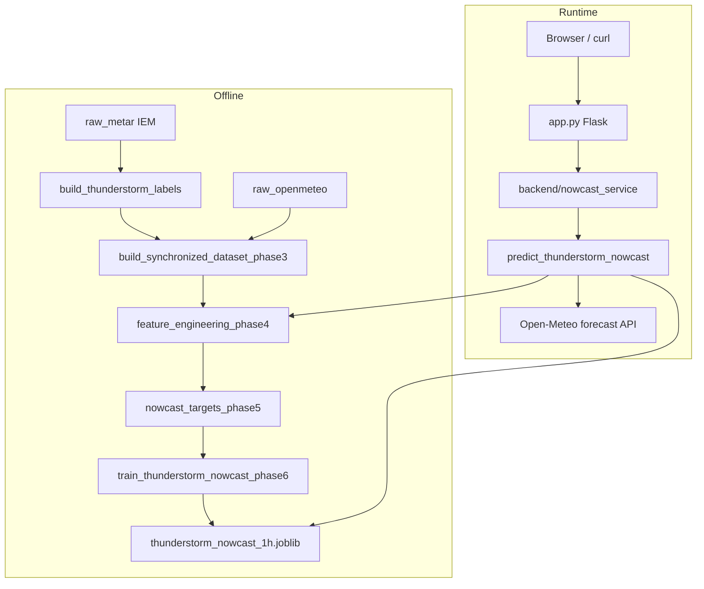
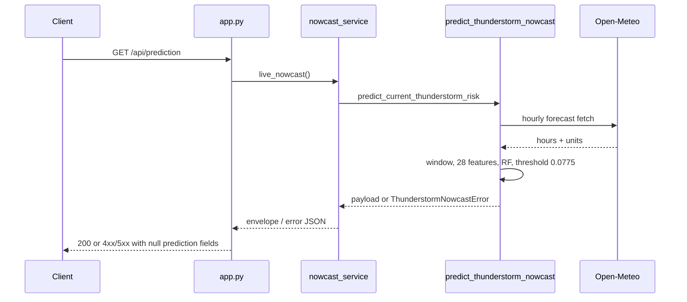

# Architecture — SIH26072 V2 (copied V1 baseline)

This directory documents **what exists in the copied tree**, not a planned V2 architecture. Source files were not modified.

## 概述

**Thunderstorm Nowcast Decision Support (VOTV)** is a Flask research prototype for Smart India Hackathon problem **SIH26072**. It serves a **1-hour thunderstorm nowcast for a single station** (VOTV, Thiruvananthapuram).

**Users** are developers and reviewers of the SIH prototype. The served product is a two-level alert (`Thunderstorm alert` / `No thunderstorm alert`) against a locked Random Forest score threshold.

**What it actually does today**

1. Fetch latest Open-Meteo hours for one VOTV grid cell.
2. Build the same **28 causal features** used in training (`dataset/feature_engineering_phase4.py`).
3. Score `models/thunderstorm_nowcast_1h.joblib`.
4. Compare against locked threshold **0.0775**.
5. On any data/provider failure, **refuse** (prediction fields `null`). Nothing is imputed.

**Explicit V1 bounds (still true in this copy)**

- One location, one served lead time (1 h).
- Labels: genuine VOTV METAR present weather, not radar/satellite/lightning/NWP.
- 2 h / 3 h models exist as Phase 6 evidence; they are **not** served.
- A separate Phase 1 **precipitation-proxy** model is still exposed at `/api/prediction/proxy`.

V2 intent (multimodal, multi-location) is **not implemented** in this tree.

## 技术栈

**语言与运行时**

- Python 3.12 (training recorded as 3.12.10 in `models/thunderstorm_nowcast_1h_metadata.json`)

**框架**

- Flask 3.1.3 (pinned in `requirements.txt`)
- gunicorn 23.0.0 (Docker CMD)
- scikit-learn 1.6.1 RandomForestClassifier
- pandas 3.0.5, numpy 2.2.1, joblib 1.6.0, requests 2.34.2

**数据存储**

- No database. Hourly CSVs under `dataset/`, joblib models under `models/`, evidence under `outputs/`.
- `dataset/.cache.sqlite` exists (Open-Meteo/cache related); not used as an application database.

**基础设施**

- `Dockerfile` (`python:3.12-slim-bookworm`, non-root `appuser`, PORT default 10000)
- README mentions Render demo URL; no CI config files were found in this copy.

**外部服务 (runtime)**

- Open-Meteo forecast API (no API key)
- Browser: Leaflet 1.9.4 + Chart.js 4.4.1 (jsDelivr), Esri World Street Map tiles

**训练/标签数据 (offline)**

- Iowa Environmental Mesonet METAR archive (`dataset/raw_metar/`)
- Open-Meteo archive hourly series (`dataset/raw_openmeteo/`)

## 项目结构

```
SIH2_v2/
├── app.py                 # Flask entry: routes, legacy proxy, dashboard
├── backend/               # Phase 8 transport over Phase 7 engine
├── ml/                    # Phase 1 train/predict + Phase 6/7 nowcast
├── dataset/               # labels, sync, features, targets, raw CSVs
├── models/                # joblib + metadata
├── outputs/               # phase reports, metrics, PNGs, verifiers
├── templates/, static/    # Phase 9 dashboard
├── frontend/              # Phase 9 verifier only
├── Dockerfile, .dockerignore, requirements*.txt
└── README.md
```

**入口点**

- Runtime: `app.py` (`app` Flask object; `python app.py` or gunicorn `app:app`)
- Live nowcast: `backend/nowcast_service.py` → `ml/predict_thunderstorm_nowcast.py`
- Offline pipeline: `dataset/build_*.py` → `ml/train_thunderstorm_nowcast_phase6.py`

## 子系统

### Dataset / labels (Phases 2–5)

**目的**: Build a contiguous hourly table with genuine METAR thunderstorm labels and 28 causal features.  
**位置**: `dataset/`  
**关键文件**: `build_thunderstorm_labels.py`, `build_synchronized_dataset_phase3.py`, `feature_engineering_phase4.py`, `nowcast_targets_phase5.py`  
**依赖**: IEM METAR CSVs, Open-Meteo archive CSVs  
**被依赖**: Phase 6 training, Phase 7 live feature builder (imports Phase 4 module)

### Training (Phase 6)

**目的**: Train RF for 1h/2h/3h targets; lock 1h threshold on validation F2.  
**位置**: `ml/train_thunderstorm_nowcast_phase6.py`  
**产物**: `models/thunderstorm_nowcast_*h.joblib`, `outputs/thunderstorm_nowcast_*`

### Live nowcast engine (Phase 7)

**目的**: Fetch live Open-Meteo, same 28 features, score 1h model, refuse on bad input.  
**位置**: `ml/predict_thunderstorm_nowcast.py`  
**被依赖**: `backend/nowcast_service.py`

### HTTP API (Phase 8)

**目的**: Expose nowcast + retained Phase 1 proxy endpoints.  
**位置**: `app.py`, `backend/nowcast_service.py`

### Dashboard (Phase 9)

**目的**: Decision-support UI + map for one station.  
**位置**: `templates/index.html`, `static/dashboard.js`, `static/style.css`

### Legacy Phase 1 surrogate

**目的**: High accumulated precipitation proxy (not thunderstorm).  
**位置**: `ml/train_model.py`, `ml/predict.py`, `models/storm_risk_model.joblib`  
**HTTP**: `/api/prediction/proxy`, `/api/evaluation`, `/api/scenario`, `/api/history`

## 图表





## 模型产物现状（本拷贝）

| 文件 | 角色 | 备注 |
|------|------|------|
| `thunderstorm_nowcast_1h.joblib` | 线上 1h 产品 | ~144 MB |
| `storm_risk_model.joblib` | Phase 1 降水代理 | ~130 MB，惰性加载 |
| `thunderstorm_nowcast_2h.joblib` | Phase 6 证据 | **本拷贝仅 134 bytes** — 不是完整模型 |
| `thunderstorm_nowcast_3h.joblib` | Phase 6 证据 | **本拷贝仅 134 bytes** — 不是完整模型 |

2h/3h metadata JSON 仍在；joblib 本体在这次拷贝中不完整。

## 不存在的能力

Radar, satellite, lightning networks, NWP fields, multi-station ingest, spatial cells, auth, write APIs, CI configs — **not in this repository**.
